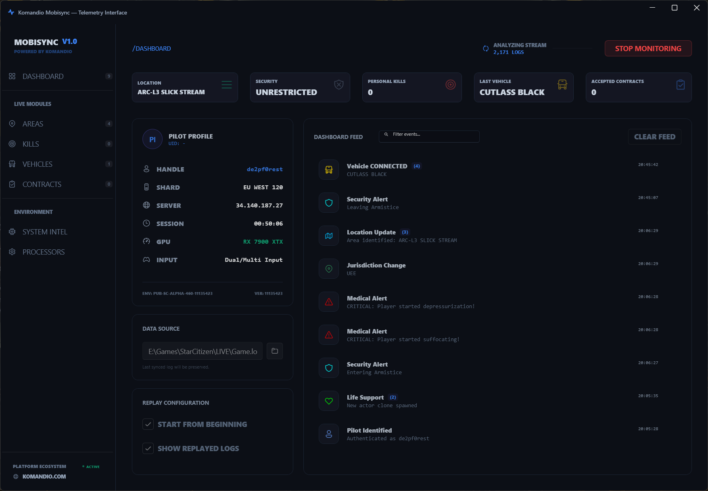
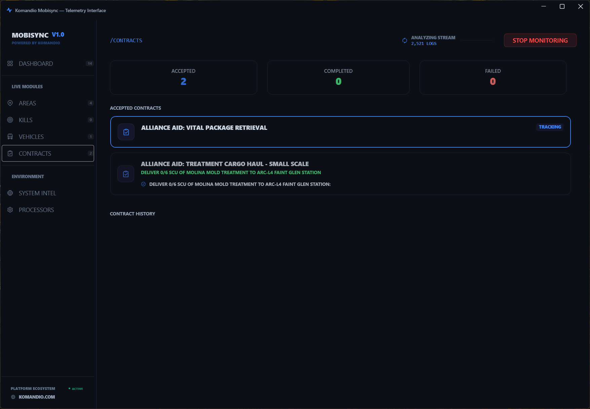
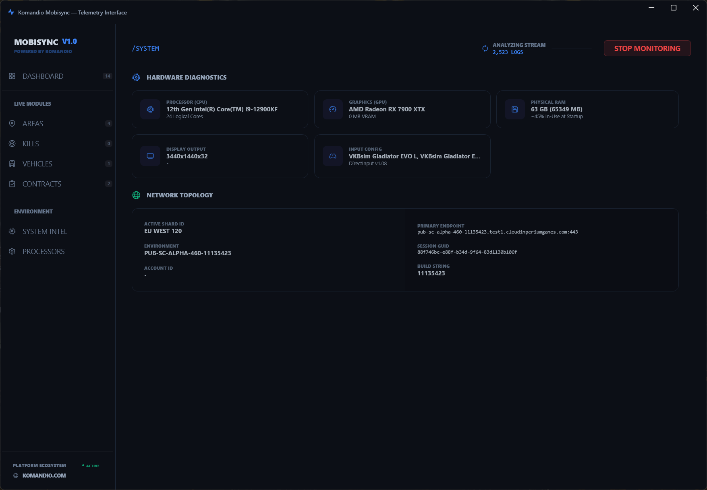
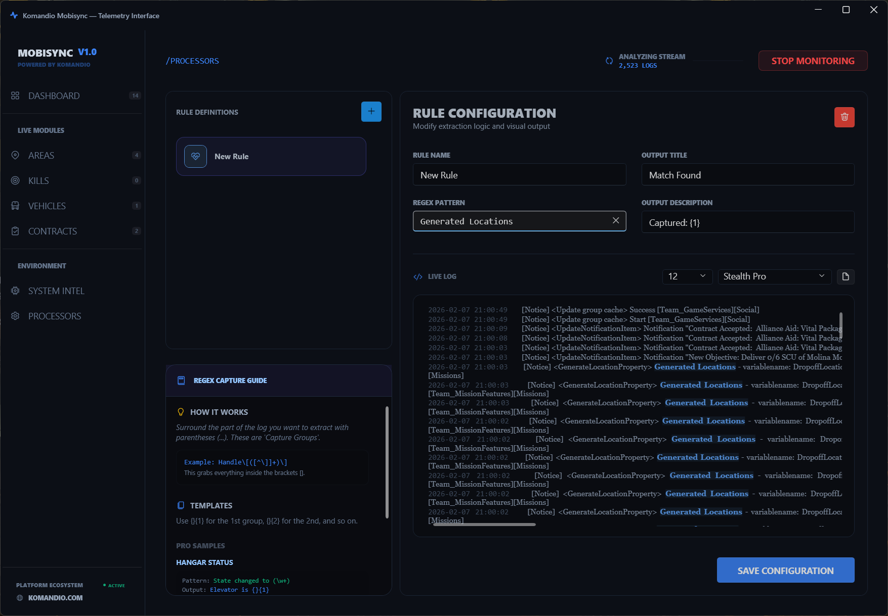

# MobiSync - Star Citizen Telemetry Dashboard

MobiSync is a powerful, real-time log monitoring and telemetry dashboard designed specifically for Star Citizen pilots. It provides an at-a-glance view of your game session, hardware performance, and contract progress, all by non-intrusively parsing your `Game.log` file.

| Main Dashboard | Contract Tracking |
|:---:|:---:|
|  |  |

| Hardware Intel | Custom Processors |
|:---:|:---:|
|  |  |

## 🚀 Key Features

- **Dashboard Intelligence:** Real-time tracking of your pilot handle, shard ID, server IP, and session uptime.
- **Contract Management:** Authoritative HUD-focus following. See clean, human-readable objectives and mission history without technical engine noise.
- **Hardware Diagnostics:** Automatic detection of your CPU, GPU, RAM, and connected peripherals (Joysticks/HOTAS) directly from the game's initialization logs.
- **Network Topology:** Monitor your connection to the Star Citizen mesh, including dynamic shard updates as you transition from the frontend to the Persistent Universe.
- **Live Telemetry:** Dedicated modules for Jurisdiction tracking, Combat confirmations (Kills), and Vehicle/Ship status.
- **Custom Logic Stores:** Add your own regular expressions to capture specific log events and surface them in the UI.

## ⚡ Powered by Komandio

MobiSync is a utility developed by the **Komandio** team. It serves as a promotional companion to the **Komandio App**, the ultimate AI-powered voice assistant for gamers.

While MobiSync handles your visual telemetry, the **Komandio App** enables you to control your ship, manage systems, and interact with the game world using natural language voice commands.

Discover the future of gaming at [komandio.com](https://www.komandio.com).

## 🛠️ How to Use MobiSync

MobiSync is designed to be lightweight and non-intrusive. It reads your game logs without ever touching Star Citizen's memory or files.

### **1. Setup & Log Selection**
On first launch, you must tell MobiSync where your `Game.log` is located.
- Navigate to your Star Citizen installation folder.
- Typically: `C:\Games\StarCitizen\LIVE\Game.log`.
- Once selected, the **INITIALIZE** button will become active.

### **2. Start Monitoring**
Click **INITIALIZE** to start the telemetry engine. The app will begin "tailing" the log in real-time.
- **Automatic Reset:** MobiSync is smart. Every time you launch a fresh instance of Star Citizen, the app detects the new log header and automatically wipes your previous stats and counters to start your session fresh.

### **3. Configuration Options**
In the **Dashboard** tab, you can fine-tune how the app handles your history:
- **Start From Beginning:** If checked, MobiSync will scan the log from the very first line. This is **strongly recommended** if you want to capture your hardware info, shard ID, and pilot handle after the game is already running.
- **Show Replayed Logs:** If checked, events found during the "catch-up" phase will be added to your feed. If unchecked, the app will process the history silently to update your stats (like total kills) but only show new events in the feed.

### **4. Recommended Workflow**
For the best experience:
1.  **Keep it running:** Launch MobiSync once and keep it on your secondary monitor.
2.  **Start from Beginning:** Keep this option **Enabled**. It ensures that if you join a game late, the app still finds your Shard ID and Hardware specs.
3.  **Automatic Lifecycle:** You don't need to touch the app between play sessions; it will reset itself automatically whenever you restart the game.

### **Command Line Arguments**
For power users and sim-pit owners, MobiSync supports several startup arguments:

- `--secondary-screen`: Automatically moves the window to your second monitor.
- `--half-height`: Resizes the window to 50% of the screen height (optimized for vertical/portrait monitors).
- `--view=[DASHBOARD|AREAS|KILLS|VEHICLES|CONTRACTS|SYSTEM]`: Start the app in a specific tab.
- `--auto-start`: Immediately begins monitoring the log file on launch.

**Example Setup:**
`MobiSync.exe --secondary-screen --half-height --view=CONTRACTS --auto-start`

## 🏗️ Development

MobiSync is built using **.NET 10** and **WPF-UI**, utilizing an MVVM architecture for high performance and a modern Windows 11-native aesthetic.

### **Data Storage**
To keep your installation folder clean, all user data, custom processors, and settings are stored in:
`%LOCALAPPDATA%\Komandio\Tools\Mobisync`

### **Building from Source**
1. Clone the repository.
2. Build via .NET CLI:
   ```powershell
   dotnet build -p:Platform=x64
   ```
3. Generate the single-file bundle:
   ```powershell
   ./scripts/publish.ps1
   ```

## 🤖 Engineering & Vibe Coding

MobiSync is a product of modern AI-assisted engineering. It was developed entirely using **Vibe Coding** principles through the **Gemini CLI**. 

By leveraging natural language and intent-driven development, we were able to iterate rapidly—from initial UI sketches to a high-performance, multi-threaded telemetry engine—ensuring that the code matches the "vibe" and aesthetic of the Komandio ecosystem perfectly.

---
*Disclaimer: MobiSync is a fan-made third-party tool and is not affiliated with Cloud Imperium Games or Roberts Space Industries.*

## 📜 License & Trademarks

### **Software License**
This project is licensed under the **MIT License** - see the [LICENSE](LICENSE) file for details.

### **Trademark Notice**
**Komandio™**, the Komandio logo, and the name "MobiSync" are trademarks or registered trademarks of the **Komandio Team**.

While the source code of this project is open-source and permissive, the branding, logos, and product names are not. Use of these marks in any way that suggests endorsement or affiliation without prior written consent is prohibited.
